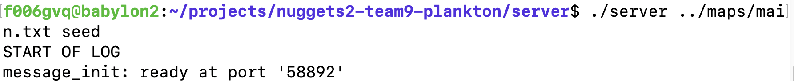

* -1: Data structures of the game module are missing

* -0.5: The server gets started with non-integer seed, but the requirement was that the seed must be a positive integer. 

* -0.5: Server should include the name of the player who quit early. In the README.md, the team assumed that the Game over message doesn't include info about quit player. However, the assumption is false since the requirements explicitly mentioned “The game-over summary shall be the phrase "GAME OVER:" followed by a simple textual table with one row for every player (including any who quit early)..."
